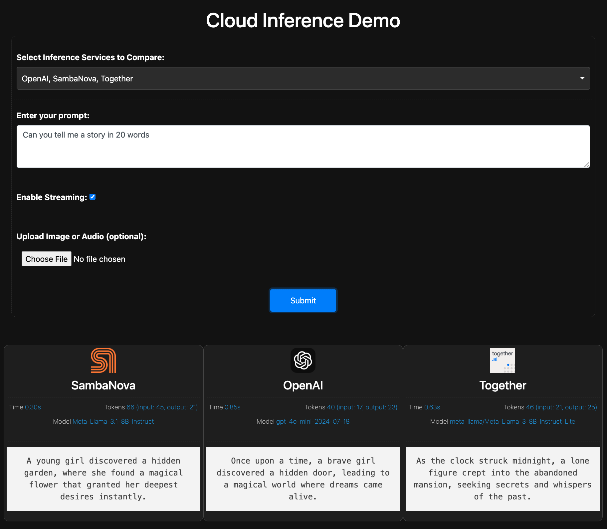

# Cloud Inference Demo

This repository contains a cloud-based inference service demo, where multiple AI inference services can be compared. The service allows users to upload an image or audio file, provide a text prompt, and get inference results from various AI providers. The results are displayed in a clean, interactive interface.

### Screenshot of the Application

This is the screenshot of the app interface. It demonstrates how to select services, upload files, and view results in real time.

### Features:
- **Multiple AI Services**: Supports multiple AI providers such as **OpenAI**, **GroQ**, **SambaNova**, **Together**, and **Cerebras**.
- **Image and Audio Input**: Users can upload image or audio files for inference.
- **Real-time Results**: Displays inference results dynamically as each service completes processing.
- **Streaming**: Results can be streaming as needed.
- **Result Visualization**: Results are displayed with tokens used, time taken, and the underlying model used.

### Table of Contents:
- [Technologies Used](#technologies-used)
- [Installation](#installation)
- [Model Configuration](#model-configuration)
- [Usage](#usage)

## Technologies Used

- **Frontend**:
  - HTML, CSS, and JavaScript
  - Bootstrap for responsive layout
  - Highlight.js for code syntax highlighting
  - Marked.js for markdown parsing
  - DOMPurify for sanitizing HTML content

- **Backend**:
  - Flask (Python web framework)
  - aiohttp for asynchronous HTTP requests
  - APIs from various inference providers like OpenAI, GroQ, Together, Cerebras and SambaNova

## Installation

### Prerequisites
1. **Python 3.x**: Ensure you have Python installed.
2. **pip**: Python package installer.

### Clone the repository:
```bash
git clone git@github.com:vanuganti/inference-demo.git
cd inference-demo
```

### Install dependencies:
- **Create a virtual environment and install the required packages**
```
python3 -m venv venv
source venv/bin/activate  # On Windows, use 'venv\Scripts\activate'
pip install -r requirements.txt
```

### Run the application:
```
python3 app.py
```
The application will start on http://localhost:5000.

## Model Configuration
Update `models_config.json` with correct models for text/vision/audio types for different inference solutions

## API Keys
You need to add all API`models_config.json` with correct models for text/vision/audio types for different inference solutions

## Usage
1. **Select Inference Services**: Choose the services you'd like to compare (e.g., OpenAI, GroQ, SambaNova, etc.).
2. **Enter a Prompt**: Provide a text prompt for inference.
3. **Upload Image or Audio (optional)**: Upload an image or audio file for inference.
4. **Submit**: Click the submit button to send the request and receive results.
5. **Results**: As each service finishes processing, the results will be displayed dynamically along with tokens usage along with time each service took. 
5. **Streaming**: When streaming is enabled, token consumption data is skipped as most APIs dont return the usage data. 

## TODO
1. **Model Selection**: Make model selection from a dropdown by fetching currently available models from the selected vendors directly.
2. **API Keys**: Make API keys as input option so that it can be updated at runtime without .env dependancy.
